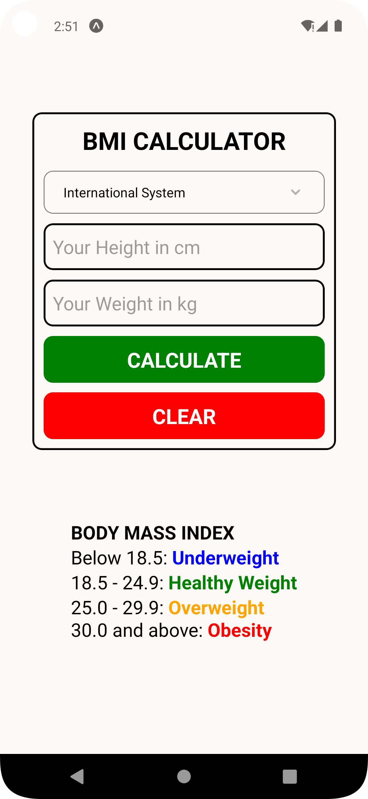
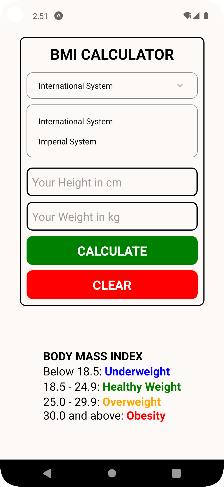
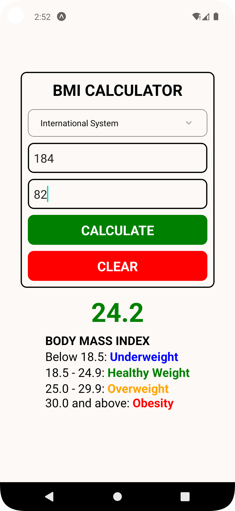

# React-Native-BMI-Calculator
BMI Calculator App in React Native

### HOW TO RUN:
```console
npm install
npx expo start
```

### DESCRIPTIONS:
Features:
1. The user should select unit system. **International System** or **Imperial System**.
2. The user should enter his/her **weight** and **height**.
3. The user should press the **Calculate Button** to see the BMI value with supporting **colors**.
4. The user can clear all fields with **Clear Button**.

### SCREENSHOTS:
<kbd></kbd>    <kbd></kbd>    <kbd></kbd>
